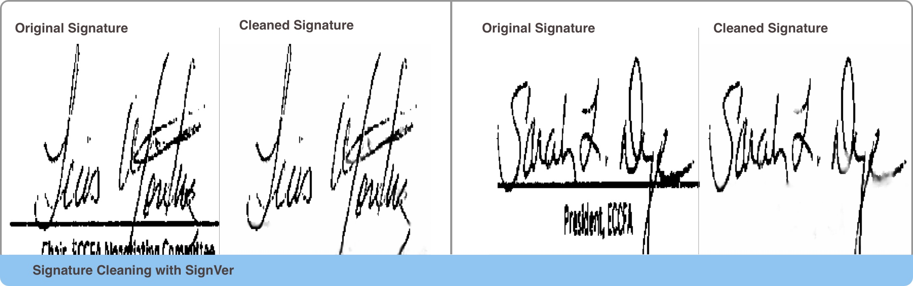

# SignVer [Alpha]: A library for Automatic Offline Signature Verification

> SignVer is in Alpha and under active development. There may be significant changes ahead.


SignVer applies modern deep learning techniques in addressing the task of offline signature verification -
given a pair (or pairs of) signatures, determine if they are produced by the same user (genuine signatures) or different users (potential forgeries). SignVer addresses this task by providing a set of modules that address subtasks required to implement signature verification in real world environments.


## Signver Library Modules

### Detector

Returns a list of bounding boxes where signatures are located in an image.

```python
from signver.detector import Detector

detector = Detector()
detector.load(detector_model_path)

boxes, scores, classes, detections = detector.detect(img_tensor)
plot_np_array(annotated_image, plot_title="Document and Extracted Signatures")

```


### Cleaner

Returns a list of cleaned signature images (removal of background lines and text), given a list of signature images

```python
# Get image crops
signatures = get_image_crops(img_tensor, boxes, scores,  threshold = 0.22 )
cleaned_sigs = cleaner.clean(np.array(signatures))

```



### Extractor

Returns a list of vector representations, given a list of image tensors/np arrays

```python
from signver.extractor import MetricExtractor

extractor = MetricExtractor()
extractor.load(extractor_model_path)

features = extractor.extract(signature_list)
```

### Matcher

Returns a distance measure given a pair of signatures

```python
from signver.matcher import Matcher

matcher = Matcher()
matcher.cosine_distance(feat1,feat2)    # 0.5
matcher.verify(feat1, feat2)    # False
```
